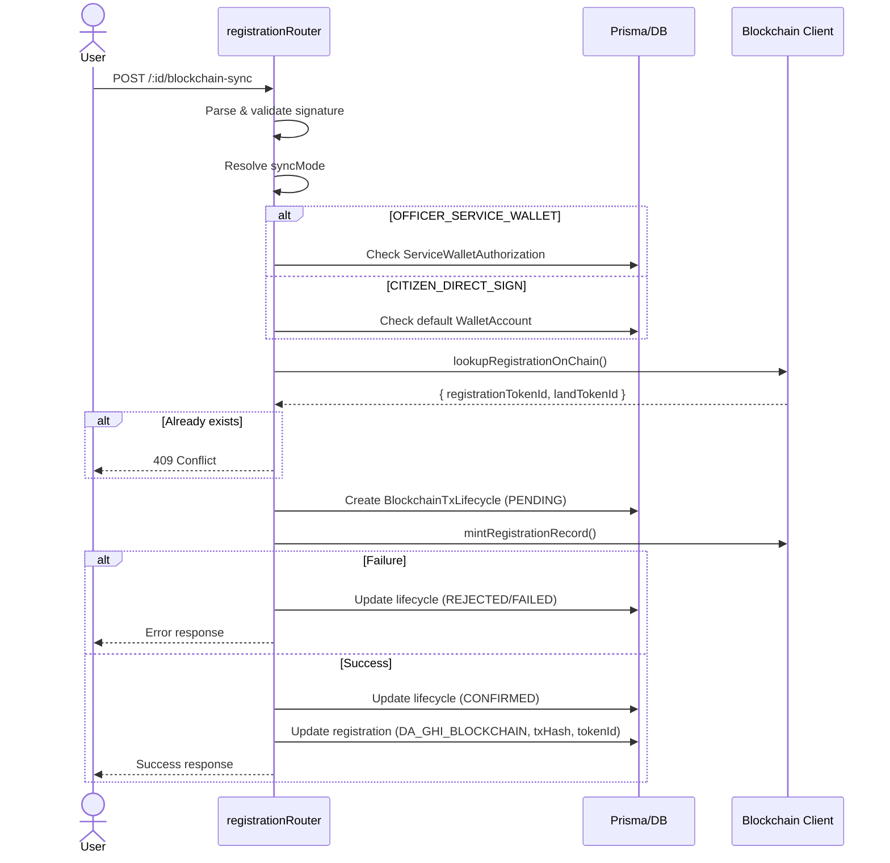

# Module Registrations

**File:** `registration.routes.ts` (2212 dòng)

Module này triển khai toàn bộ REST API cho quy trình **đăng ký đất đai lần đầu** (first-time land registration) — từ khởi tạo hồ sơ, nộp, tiếp nhận, xác nhận cấp xã, thẩm định, nghĩa vụ tài chính, phê duyệt, cập nhật địa chính, đồng bộ blockchain, đến trả kết quả.

---

## Kiến trúc state machine

Registration có 17 trạng thái, được quản lý qua:

### 1. Danh sách trạng thái (`RegistrationStatus` enum)

| Mã                                  | Ý nghĩa                           |
| ----------------------------------- | --------------------------------- |
| `MOI_TAO`                           | Mới tạo (bản nháp)                |
| `CHO_TIEP_NHAN`                     | Chờ tiếp nhận                     |
| `CAN_BO_SUNG`                       | Cần bổ sung                       |
| `DA_TIEP_NHAN`                      | Đã tiếp nhận                      |
| `CHO_XAC_NHAN_CAP_XA`               | Chờ xác nhận cấp xã               |
| `DA_XAC_NHAN_CAP_XA`                | Đã xác nhận cấp xã                |
| `DANG_THAM_DINH_VPDKDD`             | Đang thẩm định VPĐKĐĐ             |
| `CHO_THUE`                          | Chờ thửa/thông báo thuế           |
| `CHO_HOAN_THANH_NGHIA_VU_TAI_CHINH` | Chờ hoàn thành nghĩa vụ tài chính |
| `DA_HOAN_THANH_NGHIA_VU_TAI_CHINH`  | Đã hoàn thành nghĩa vụ tài chính  |
| `CHO_KY_CAP`                        | Chờ ký cấp                        |
| `DA_KY_CAP`                         | Đã ký cấp                         |
| `DA_CAP_NHAT_HO_SO_DIA_CHINH`       | Đã cập nhật hồ sơ địa chính       |
| `DA_GHI_BLOCKCHAIN`                 | Đã ghi blockchain                 |
| `DA_CAP`                            | Đã cấp                            |
| `DA_TRA_KET_QUA`                    | Đã trả kết quả                    |
| `HUY_HO_SO`                         | Hủy hồ sơ                         |
| `TU_CHOI`                           | Từ chối                           |

### 2. Đồ thị chuyển trạng thái (`STATUS_TRANSITION_GRAPH`)

```
MOI_TAO
  └── CHO_TIEP_NHAN

CHO_TIEP_NHAN
  ├── DA_TIEP_NHAN
  ├── CAN_BO_SUNG
  └── TU_CHOI

DA_TIEP_NHAN
  ├── CHO_XAC_NHAN_CAP_XA
  ├── DA_XAC_NHAN_CAP_XA
  └── CAN_BO_SUNG

CHO_XAC_NHAN_CAP_XA
  ├── DA_XAC_NHAN_CAP_XA
  └── CAN_BO_SUNG

DA_XAC_NHAN_CAP_XA
  ├── DANG_THAM_DINH_VPDKDD
  ├── CHO_THUE
  ├── CHO_HOAN_THANH_NGHIA_VU_TAI_CHINH
  └── CAN_BO_SUNG

DANG_THAM_DINH_VPDKDD
  ├── CHO_THUE
  ├── CHO_HOAN_THANH_NGHIA_VU_TAI_CHINH
  ├── CHO_KY_CAP
  ├── CAN_BO_SUNG
  └── TU_CHOI

CHO_THUE
  └── CHO_HOAN_THANH_NGHIA_VU_TAI_CHINH

CHO_HOAN_THANH_NGHIA_VU_TAI_CHINH
  ├── DA_HOAN_THANH_NGHIA_VU_TAI_CHINH
  └── CAN_BO_SUNG

DA_HOAN_THANH_NGHIA_VU_TAI_CHINH
  └── CHO_KY_CAP

CHO_KY_CAP
  ├── DA_KY_CAP
  ├── TU_CHOI
  └── DA_CAP

DA_KY_CAP
  ├── DA_CAP_NHAT_HO_SO_DIA_CHINH
  └── DA_CAP

DA_CAP_NHAT_HO_SO_DIA_CHINH
  ├── DA_GHI_BLOCKCHAIN
  ├── DA_CAP
  └── DA_TRA_KET_QUA

DA_CAP
  ├── DA_GHI_BLOCKCHAIN
  └── DA_TRA_KET_QUA

DA_GHI_BLOCKCHAIN
  └── DA_TRA_KET_QUA
```

> **Lưu ý:** `DA_GHI_BLOCKCHAIN` không thể set trực tiếp qua `PATCH /status`. Phải gọi `POST /blockchain-sync`. Hàm `assertTransitionAllowed()` chặn việc này.

### 3. Ma trận role → status được phép (`ROLE_ALLOWED_TARGET_STATUS`)

| Role                    | Được set status                                                                                                                                 |
| ----------------------- | ----------------------------------------------------------------------------------------------------------------------------------------------- |
| `CITIZEN`               | `CHO_TIEP_NHAN`                                                                                                                                 |
| `BUSINESS`              | `CHO_TIEP_NHAN`                                                                                                                                 |
| `RECEPTION_OFFICER`     | `DA_TIEP_NHAN`, `CAN_BO_SUNG`, `CHO_XAC_NHAN_CAP_XA`                                                                                            |
| `COMMUNE_OFFICER`       | `DA_XAC_NHAN_CAP_XA`, `CAN_BO_SUNG`                                                                                                             |
| `LAND_REGISTRY_OFFICER` | `DANG_THAM_DINH_VPDKDD`, `CHO_THUE`, `CHO_HOAN_THANH_NGHIA_VU_TAI_CHINH`, `CHO_KY_CAP`, `DA_CAP_NHAT_HO_SO_DIA_CHINH`, `CAN_BO_SUNG`, `TU_CHOI` |
| `APPROVAL_AUTHORITY`    | `DA_KY_CAP`, `TU_CHOI`, `DA_CAP`                                                                                                                |
| `TAX_OFFICER`           | `DA_HOAN_THANH_NGHIA_VU_TAI_CHINH`, `CAN_BO_SUNG`                                                                                               |
| `ADMIN`                 | Tất cả 17 status                                                                                                                                |

---

## Endpoints chi tiết

### `GET /` — Danh sách hồ sơ

- **Auth:** Tất cả authenticated users
- **Query params:** `status`, `keyword`, `procedureCode`, `page` (default 1), `pageSize` (default 20, max 100)
- **Behavior:**
  - Citizen/Business: chỉ thấy hồ sơ của mình (`applicantId = user.userId`)
  - Officers/Admin: thấy tất cả
  - Keyword search trên: `code`, `ownerFullName`, `parcelNumber`, `mapSheetNumber`, `address`

### `POST /` — Tạo hồ sơ mới

- **Auth:** Citizen/Business
- **Body:**
  ```typescript
  {
    landInfo: { provinceCode, communeName, parcelNumber, mapSheetNumber, area, landUsePurpose, address },
    ownerInfo: { ownerType, fullName, identityNumber?, address? },
    procedureCode?: string,        // mặc định DEFAULT_REGISTRATION_PROCEDURE_CODE
    legalBasisCode?: string,
    attachedFileIds?: string[]     // connect file assets đã upload
  }
  ```
- **Behavior:**
  1. Validate `procedureCode` (tra cứu `LegalProcedure`)
  2. Sinh mã hồ sơ (`REG-YYYY-timestamp-random`)
  3. Tạo `Registration` record + connect files
  4. Tự động tạo `RegistrationDocumentVersion` cho mỗi file đính kèm
  5. Audit log `REGISTRATION_CREATED`

### `GET /:id` — Chi tiết hồ sơ

- Tra cứu theo `id` hoặc `code`
- Citizen/Business: chỉ xem được hồ sơ của mình

### `GET /:id/notifications` — Lịch sử thông báo

- Lấy audit logs loại `REGISTRATION_NOTIFICATION_SENT` (100 bản ghi gần nhất)

### `GET /:id/document-versions` — Lịch sử phiên bản tài liệu

- Tất cả `RegistrationDocumentVersion` của registration (sắp xếp theo versionNumber desc)

### `POST /:id/document-versions` — Tạo phiên bản tài liệu mới

- **Auth:** Citizen, Reception Officer, Commune Officer, Land Registry Officer, Admin
- **Behavior:**
  1. Validate `fileAssetId` (nếu có) thuộc registration
  2. Gắn nhãn `REPLACED` cho tất cả version `ACTIVE` cùng documentType
  3. Tạo version mới với số version kế tiếp

### `GET /:id/snapshots` — Lịch sử snapshot nộp hồ sơ

- Tất cả `RegistrationSubmitSnapshot`

### `GET /:id/document-history` — Timeline tổng hợp

- Hợp nhất và sắp xếp theo thời gian: document versions + submit snapshots + status audit logs
- 3 loại event: `DOCUMENT_VERSION`, `SUBMIT_SNAPSHOT`, `STATUS_AUDIT`

### `POST /:id/submit` — Nộp hồ sơ

- **Auth:** Citizen/Business
- **Preconditions:** Status là `MOI_TAO` hoặc `CAN_BO_SUNG`
- **Behavior:**
  1. Lock tất cả `ACTIVE` document versions → `LOCKED`
  2. Tạo `RegistrationSubmitSnapshot` (snapshotNo tăng dần)
  3. Nếu procedure yêu cầu thuế (`requiresTaxStep`): tự động tạo `INTAKE_FEE` payment obligation
  4. Chuyển status → `CHO_TIEP_NHAN`
  5. Set `submittedSnapshotLocked = true`

### `PATCH /:id/status` — Cập nhật trạng thái thủ công

- **Auth:** Officers (except citizen roles)
- **Body:** `{ status, legalBasisCode, reason? }`
- reason bắt buộc nếu status = `CAN_BO_SUNG` hoặc `TU_CHOI`
- Validation: status transition graph + role permission

### `POST /:id/commune-confirm` — Xác nhận cấp xã

- **Auth:** Commune Officer, Admin
- **Body:** `{ confirmed: boolean, legalBasisCode, notes, evidenceFileId }`
- `evidenceFileId` phải thuộc registration
- confirmed = true → `DA_XAC_NHAN_CAP_XA`, false → `CAN_BO_SUNG`
- Ghi audit log `REGISTRATION_COMMUNE_CONFIRMATION_RECORDED`

### `POST /:id/tax-transfer` — Chuyển nghĩa vụ tài chính

- **Auth:** Land Registry Officer, Admin
- **Body:** `{ legalBasisCode, taxReferenceNo, amount?, notes? }`
- Tạo `LAND_FINANCIAL_OBLIGATION` obligation (status PENDING)
- Chuyển status → `CHO_HOAN_THANH_NGHIA_VU_TAI_CHINH`

### `POST /:id/approve` — Phê duyệt/ký cấp

- **Auth:** Approval Authority, Admin
- **Body:** `{ legalBasisCode, approvalNumber?, approvalDate?, note?, landCode? }`
- Chuyển status → `DA_KY_CAP`
- Gắn `landCode` (mặc định `LAND-{timestamp}` nếu không cung cấp)
- Audit log `REGISTRATION_APPROVED`

### `POST /:id/cadastral-update` — Cập nhật hồ sơ địa chính

- **Auth:** Land Registry Officer, Admin
- Chuyển status → `DA_CAP_NHAT_HO_SO_DIA_CHINH`, ghi `cadastralUpdatedAt = now()`

### `GET /:id/blockchain-sync/candidates` — Danh sách service wallet ký blockchain

- **Auth:** Land Registry Officer, Approval Authority
- Trả về các `ServiceWalletAuthorization` còn hiệu lực, đúng network/chainId, thuộc user hiện tại

### `POST /:id/blockchain-sync` — Đồng bộ lên blockchain

- **Auth:** Citizens, Businesses, Land Registry Officer, Approval Authority
- Đây là endpoint phức tạp nhất. Luồng xử lý:

  **1. Pre-validation:**
  - Chưa có `txHash` hoặc `tokenId` (không sync lại)
  - Status phải là `DA_CAP_NHAT_HO_SO_DIA_CHINH` hoặc (`DA_CAP` + đã có `cadastralUpdatedAt`)
  - Validate `procedure` + `authority`

  **2. Xác thực chữ ký:**
  - Parse `signerWalletAddress` bằng `ethers.getAddress()`
  - Recover signer từ `signingMessage` + `signature` — so khớp với `signerWalletAddress`

  **3. Xác thực wallet authorization (2 chế độ):**
  - **OFFICER_SERVICE_WALLET:** Kiểm tra `ServiceWalletAuthorization` — hạn dùng, network, chainId, roleScope, ownership
  - **CITIZEN_DIRECT_SIGN:** Kiểm tra user sở hữu hồ sơ, `WalletAccount` mặc định đã xác minh, khớp address

  **4. On-chain precheck:**
  - Gọi `lookupRegistrationOnChain()` kiểm tra chưa có token

  **5. Ghi blockchain:**
  - Tạo `BlockchainTxLifecycle` (status = PENDING)
  - Gọi `mintRegistrationRecord()` — nếu fail, cập nhật lifecycle status (REJECTED/FAILED) và audit log
  - Nếu thành công: cập nhật lifecycle → CONFIRMED, ghi `txHash`, `explorerUrl`

  **6. Cập nhật DB:**
  - Status → `DA_GHI_BLOCKCHAIN`
  - Lưu `ipfsCid`, `documentHash`, `txHash`, `tokenId`
  - Audit log `REGISTRATION_BLOCKCHAIN_SYNCED` + notification

### `GET /:id/blockchain-status` — Đối soát on-chain/off-chain

- **Auth:** Land Registry Officer, Approval Authority, Admin, Auditor
- Tra cứu on-chain qua `lookupRegistrationOnChain()`
- So sánh `offChainLinked` (có txHash/tokenId trong DB) vs `onChainLinked` (có token trên contract)
- Trả về `inSync: boolean`

### `GET /:id/tx-lifecycle` — Vòng đời giao dịch blockchain

- **Auth:** Land Registry Officer, Approval Authority, Admin, Auditor
- Danh sách `BlockchainTxLifecycle` của registration

### `POST /:id/request-supplement` — Yêu cầu bổ sung

- **Auth:** Reception Officer, Commune Officer, Land Registry Officer, Tax Officer, Admin
- **Body:** `{ legalBasisCode, note, missingItems: string[], deadlineAt: ISO datetime }`
- `deadlineAt` phải là tương lai
- Chuyển status → `CAN_BO_SUNG`, kèm danh mục missing items và deadline

### `POST /:id/accept` — Tiếp nhận hồ sơ

- **Auth:** Reception Officer, Admin
- Chuyển status → `DA_TIEP_NHAN`

### `POST /:id/reject` — Từ chối hồ sơ

- **Auth:** Land Registry Officer, Approval Authority, Admin
- Chuyển status → `TU_CHOI`
- `reason` bắt buộc

### `GET /:id/payment-obligations` — Danh sách nghĩa vụ tài chính

- **Auth:** Tất cả authenticated users
- Citizen/Business: chỉ xem được của mình

### `POST /:id/payment-obligations` — Tạo nghĩa vụ tài chính

- **Auth:** Reception Officer, Land Registry Officer, Tax Officer, Admin
- **Body:** `{ type, legalBasisCode, referenceNo?, noticeRef?, receiptRef?, receiptFileId?, amount?, note? }`
- `LAND_FINANCIAL_OBLIGATION` chỉ được tạo bởi Land Registry Officer, Tax Officer, Admin
- `receiptFileId` (nếu có) phải thuộc registration

### `PATCH /:id/payment-obligations/:obligationId/status` — Xác nhận nghĩa vụ tài chính

- **Auth:** Tax Officer, Admin
- **Body:** `{ status: PENDING | CONFIRMED | CANCELLED, legalBasisCode, note? }`
- Nếu `CONFIRMED` và registration đang ở `CHO_HOAN_THANH_NGHIA_VU_TAI_CHINH`:
  tự động chuyển → `DA_HOAN_THANH_NGHIA_VU_TAI_CHINH`

---

## Helper functions chính

| Hàm                                         | Mô tả                                                                                              |
| ------------------------------------------- | -------------------------------------------------------------------------------------------------- |
| `isCitizenRole()`                           | Kiểm tra role có thuộc nhóm citizen/business                                                       |
| `assertTransitionAllowed()`                 | Kiểm tra transition graph + role permission. Chặn direct set `DA_GHI_BLOCKCHAIN`                   |
| `ensureProcedureAndAuthority()`             | Kiểm tra `LegalProcedure` active + actor role ∈ authority actors                                   |
| `ensureServiceWalletAuthorizationForSync()` | Xác thực service wallet: hạn dùng, network, chainId, ownership, roleScope                          |
| `ensureCitizenWalletAuthorizationForSync()` | Xác thực citizen wallet: ownership hồ sơ, wallet mặc định, network                                 |
| `resolveBlockchainSyncMode()`               | Phân giải sync mode theo role: citizen → `CITIZEN_DIRECT_SIGN`, officer → `OFFICER_SERVICE_WALLET` |
| `classifyBlockchainErrorStatus()`           | Parse lỗi blockchain: user denied → REJECTED, còn lại → FAILED                                     |
| `findRegistrationByParam()`                 | Tra cứu registration theo `id` hoặc `code`                                                         |
| `updateStatus()`                            | Core function: validate + update status + ghi noteHistory + audit log + notification               |
| `createDocumentVersion()`                   | Tạo version mới với versionNumber tự động tăng                                                     |
| `ensureActiveDocumentVersions()`            | Tự động seed document versions từ files nếu chưa có                                                |
| `createSubmissionSnapshot()`                | Tạo snapshot nộp hồ sơ với snapshotNo tự động tăng                                                 |
| `toRegistrationItem()`                      | Transform Prisma model → response shape                                                            |
| `toDocumentVersionItem()`                   | Transform document version → response shape                                                        |
| `toPaymentObligationItem()`                 | Transform payment obligation → response shape                                                      |

---

## Audit logging

Tất cả hành động quan trọng đều ghi `AuditLog` với các action types:

- `REGISTRATION_CREATED`
- `REGISTRATION_STATUS_UPDATED`
- `REGISTRATION_NOTIFICATION_SENT`
- `REGISTRATION_COMMUNE_CONFIRMATION_RECORDED`
- `REGISTRATION_SUPPLEMENT_REQUESTED`
- `REGISTRATION_APPROVED`
- `REGISTRATION_BLOCKCHAIN_SYNCED`
- `REGISTRATION_BLOCKCHAIN_STATUS_CHECKED`
- `REGISTRATION_BLOCKCHAIN_TX_LIFECYCLE_VIEWED`
- `REGISTRATION_DOCUMENT_VERSION_CREATED`
- `REGISTRATION_PAYMENT_OBLIGATION_CREATED`
- `REGISTRATION_PAYMENT_OBLIGATION_UPDATED`
- `BLOCKCHAIN_TX_PENDING` / `BLOCKCHAIN_TX_CONFIRMED` / `BLOCKCHAIN_TX_REJECTED` / `BLOCKCHAIN_TX_FAILED`

---

## Blockchain sync flow chi tiết



---

## Role constants

```typescript
const allAuthenticatedRoles = [...AUTH_ROLES.citizen, ...AUTH_ROLES.officers];
const statusMutationRoles = [
  "RECEPTION_OFFICER",
  "COMMUNE_OFFICER",
  "LAND_REGISTRY_OFFICER",
  "APPROVAL_AUTHORITY",
  "TAX_OFFICER",
  "ADMIN"
];
```

---

## Environment variables used

| Variable                              | Mặc định                           | Mô tả                                           |
| ------------------------------------- | ---------------------------------- | ----------------------------------------------- |
| `DEFAULT_REGISTRATION_PROCEDURE_CODE` | `DKDD_LANDAU_3380`                 | Procedure code mặc định nếu không được cung cấp |
| `BLOCKCHAIN_NETWORK`                  | `SEPOLIA`                          | Mạng blockchain mục tiêu                        |
| `BLOCKCHAIN_CHAIN_ID`                 | `11155111`                         | Chain ID (Sepolia = 11155111)                   |
| `BLOCKCHAIN_EXPLORER_BASE_URL`        | `https://sepolia.etherscan.io/tx/` | Base URL cho explorer link                      |

17 trạng thái tạo thành một đồ thị có hướng (directed graph) — mỗi trạng thái chỉ có thể chuyển sang một số trạng thái nhất định. Dưới đây là cách chúng liên kết với nhau theo luồng xử lý:
Luồng chính (happy path)
MOI_TAO ──► CHO_TIEP_NHAN ──► DA_TIEP_NHAN ──► CHO_XAC_NHAN_CAP_XA
│
▼
DA_XAC_NHAN_CAP_XA
│
▼
DANG_THAM_DINH_VPDKDD
│
▼
CHO_HOAN_THANH_NVTC
│
▼
DA_HOAN_THANH_NVTC
│
▼
CHO_KY_CAP ──► DA_KY_CAP
│
▼
DA_CAP_NHAT_HSDC
│
▼
DA_GHI_BLOCKCHAIN
│
▼
DA_TRA_KET_QUA
Các nhánh rẽ và đường tắt
Nhánh Mô tả
DA_TIEP_NHAN → DA_XAC_NHAN_CAP_XA Bỏ qua bước xác nhận cấp xã (hồ sơ đặc biệt)
DANG_THAM_DINH_VPDKDD → CHO_THUE Cần thông báo thuế riêng
DANG_THAM_DINH_VPDKDD → CHO_KY_CAP Thẩm định xong → chờ ký cấp luôn (bỏ qua bước thuế)
CHO_KY_CAP → DA_CAP Bỏ qua ký cấp, duyệt thẳng
DA_KY_CAP → DA_CAP Cấp luôn không cần cập nhật địa chính
DA_CAP_NHAT_HSDC → DA_CAP Đã cập nhật địa chính → cấp luôn không cần blockchain
DA_CAP → DA_TRA_KET_QUA Cấp xong → trả kết quả (bỏ qua blockchain)
Nhánh từ chối / hủy

- Từ chối (TU_CHOI) từ: CHO_TIEP_NHAN, DANG_THAM_DINH_VPDKDD, CHO_KY_CAP
- Cần bổ sung (CAN_BO_SUNG) từ hầu hết các trạng thái — và từ CAN_BO_SUNG quay lại CHO_TIEP_NHAN
  Vòng lặp bổ sung
  ... ──► CAN_BO_SUNG ──► CHO_TIEP_NHAN ──► ... (tiếp tục luồng)
  Đây là vòng lặp duy nhất trong đồ thị — cho phép citizen bổ sung hồ sơ và nộp lại.
  Tóm tắt quan hệ
- Luồng tuyến tính là chính: từ tạo → tiếp nhận → xác nhận → thẩm định → thuế → ký → địa chính → blockchain → trả kết quả
- Các đường tắt (skip steps) tồn tại để linh hoạt theo nghiệp vụ thực tế
- CAN_BO_SUNG là trạng thái "hub" — có thể đến từ nhiều nơi và quay về CHO_TIEP_NHAN
- TU_CHOI là trạng thái "terminal" — không thể chuyển tiếp đi đâu
- DA_GHI_BLOCKCHAIN là trạng thái đặc biệt — không thể set thủ công, chỉ qua endpoint blockchain-sync
