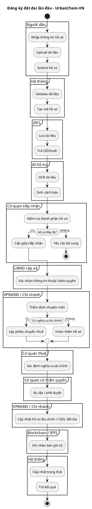

# 09. Business Processes — UrbanChain-VN

> Tài liệu này mô tả quy trình nghiệp vụ chi tiết cho MVP UrbanChain-VN.  
> File này dùng làm nguồn tham chiếu cho Codex, AI agents, sơ đồ UML/swimlane và báo cáo.

---

## 1. Nguyên tắc mô phỏng nghiệp vụ

UrbanChain-VN mô phỏng quy trình nghiệp vụ đất đai theo hướng số hóa, nhưng không thay thế quyết định hành chính ngoài thực tế.

Các nguyên tắc bắt buộc:

1. **Cơ quan nhà nước là chủ thể quyết định nghiệp vụ.**
   - AI không duyệt hồ sơ.
   - Smart contract không tự quyết định hồ sơ hợp lệ.
   - Hệ thống chỉ hỗ trợ luân chuyển, ghi nhận và truy vết.

2. **CSDL nghiệp vụ là nguồn dữ liệu chính.**
   - Blockchain chỉ là lớp ghi nhận bổ sung.
   - IPFS chỉ là lớp lưu tài liệu số/off-chain.

3. **Ghi blockchain chỉ xảy ra sau khi hồ sơ đã hợp lệ trong quy trình nghiệp vụ.**
   - Đăng ký lần đầu: ghi sau khi hồ sơ được phê duyệt/cấp hợp lệ.
   - Chuyển nhượng/biến động: ghi sau khi cập nhật biến động hợp lệ.

4. **AI OCR chỉ là công cụ hỗ trợ.**
   - AI đọc tài liệu, trích xuất dữ liệu, sinh cảnh báo.
   - Cán bộ kiểm tra và ra quyết định cuối cùng.

5. **Mọi thao tác quan trọng phải có audit log.**

### Legal Source Reference

- Nguồn pháp lý chuẩn: [00-legal-basis-register.md](./00-legal-basis-register.md)
- Ma trận traceability: [docs-legal-aligned/16-legal-requirement-traceability.md](./docs-legal-aligned/16-legal-requirement-traceability.md)

Rule triển khai nghiệp vụ:
- Actor phải đúng theo phân định thẩm quyền 2 cấp.
- Phí/lệ phí tiếp nhận và nghĩa vụ tài chính phải tách ở off-chain.
- Chỉ ghi blockchain sau khi bước cập nhật hồ sơ địa chính/CSDL đất đai đã hợp lệ.

### Legal override rule (2026-05-10)

- Nguồn pháp lý chuẩn: `docs/docs-legal-aligned/*`.
- Nếu nội dung mô tả workflow cũ (English states) mâu thuẫn với state machine legal-aligned, ưu tiên state machine legal-aligned trong phụ lục của tài liệu này và trong `docs/05-workflow-land-law.md`.
- Trạng thái triển khai hiện tại theo legal baseline:
  - Sprint 1: `Done`
  - Sprint 2: `Partial` (còn `LEG-S2-001..005`)
  - Sprint 3: `Partial` (phụ thuộc LEG-S2 + `LEG-S3-*`)
  - Sprint 4: `Partial` (còn `LEG-S4-001`)

---

## 2. Tác nhân nghiệp vụ

| Tác nhân | Vai trò trong hệ thống |
|---|---|
| Người dân | Tạo hồ sơ đăng ký lần đầu, upload tài liệu, theo dõi trạng thái, tra cứu |
| Doanh nghiệp | Tham gia tra cứu, giao dịch/chuyển nhượng trong phạm vi được phép |
| Cơ quan tiếp nhận hồ sơ và trả kết quả | Tiếp nhận hồ sơ, kiểm tra thành phần, cấp giấy hẹn/yêu cầu bổ sung, trả kết quả |
| UBND cấp xã | Xác nhận thông tin thuộc thẩm quyền cấp xã trong đăng ký lần đầu |
| VPĐKĐĐ / Chi nhánh VPĐKĐĐ | Thẩm định chuyên môn, cập nhật hồ sơ địa chính/CSDL đất đai, xử lý biến động |
| Cơ quan thuế | Xác định nghĩa vụ tài chính khi hồ sơ phát sinh nghĩa vụ |
| Cơ quan có thẩm quyền ký cấp/phê duyệt | Ký cấp/phê duyệt kết quả theo quy trình |
| Hệ thống UrbanChain-VN | Luân chuyển hồ sơ, lưu trạng thái, tích hợp IPFS/OCR/Blockchain |
| AI hỗ trợ | OCR, đối chiếu dữ liệu, cảnh báo thiếu/sai lệch |
| Blockchain/IPFS | Lưu CID/hash, transaction hash, lịch sử số, tài liệu số off-chain |

---

## 3. Quy trình 1 — Đăng ký đất đai lần đầu

### 3.1. Mục tiêu

Người dân nộp hồ sơ đăng ký đất đai lần đầu. Hệ thống hỗ trợ số hóa hồ sơ, lưu file IPFS, OCR, luân chuyển qua các bước tiếp nhận, xác nhận, thẩm định, nghĩa vụ tài chính nếu có, ký cấp/phê duyệt, cập nhật CSDL và ghi nhận bản ghi số.

### 3.2. Quy trình chi tiết

| Bước | Tác nhân | Hoạt động | Dữ liệu vào | Dữ liệu ra / trạng thái |
|---|---|---|---|---|
| 1 | Người dân | Đăng nhập, chọn đăng ký lần đầu | Tài khoản | Phiên làm việc |
| 2 | Người dân | Nhập thông tin thửa đất, chủ sử dụng | Form hồ sơ | Hồ sơ nháp |
| 3 | Người dân | Upload tài liệu | File scan/tài liệu | File metadata |
| 4 | Hệ thống | Validate dữ liệu | Form + file | Lỗi hoặc hồ sơ hợp lệ ban đầu |
| 5 | IPFS | Lưu tài liệu số | File | CID/hash |
| 6 | AI hỗ trợ | OCR và cảnh báo | File/CID | OCR result, warnings |
| 7 | Người dân | Submit hồ sơ | Hồ sơ nháp | `SUBMITTED` |
| 8 | Cơ quan tiếp nhận | Kiểm tra thành phần hồ sơ | Hồ sơ + OCR warning | `INTAKE_REVIEW` |
| 9 | Cơ quan tiếp nhận | Yêu cầu bổ sung nếu thiếu | Lý do thiếu | `SUPPLEMENT_REQUIRED` |
| 10 | UBND cấp xã | Xác nhận thông tin thuộc thẩm quyền | Hồ sơ đã tiếp nhận | `COMMUNE_CONFIRMATION` |
| 11 | VPĐKĐĐ/Chi nhánh | Thẩm định chuyên môn | Hồ sơ + xác nhận | `LAND_OFFICE_REVIEW` |
| 12 | Cơ quan thuế | Xác định nghĩa vụ tài chính nếu có | Phiếu chuyển thông tin | `TAX_PENDING` / `TAX_COMPLETED` |
| 13 | Cơ quan ký cấp/phê duyệt | Ký cấp/phê duyệt | Hồ sơ hoàn thiện | `APPROVED` |
| 14 | VPĐKĐĐ/Chi nhánh | Cập nhật hồ sơ địa chính/CSDL đất đai | Kết quả phê duyệt | LandRecord |
| 15 | Blockchain | Ghi nhận bản ghi số | Land ID + CID/hash | txHash, event |
| 16 | Hệ thống | Cập nhật trạng thái | txHash | `BLOCKCHAIN_RECORDED` / `COMPLETED` |
| 17 | Người dân | Xem kết quả | Mã hồ sơ | Kết quả xử lý |

### 3.3. Decision points

| Decision | Người/cơ quan quyết định | Nhánh Có | Nhánh Không |
|---|---|---|---|
| Hồ sơ đầy đủ? | Cơ quan tiếp nhận | Chuyển xử lý | Yêu cầu bổ sung |
| Cần xác nhận cấp xã? | Hệ thống/cán bộ | Chuyển UBND cấp xã | Chuyển VPĐKĐĐ |
| Đủ điều kiện chuyên môn? | VPĐKĐĐ/Chi nhánh | Chuyển bước tiếp | Từ chối |
| Có nghĩa vụ tài chính? | VPĐKĐĐ/Chi nhánh | Chuyển cơ quan thuế | Bỏ qua thuế |
| Đã hoàn thành nghĩa vụ tài chính? | Cơ quan thuế/hệ thống | Trình ký/phê duyệt | Chờ hoàn thành |
| Đã phê duyệt/cấp hợp lệ? | Cơ quan có thẩm quyền | Ghi blockchain | Từ chối/kết thúc |

### 3.4. State machine

```text
MOI_TAO
  -> CHO_TIEP_NHAN
  -> CAN_BO_SUNG
  -> CHO_TIEP_NHAN
  -> DA_TIEP_NHAN
  -> CHO_XAC_NHAN_CAP_XA
  -> DA_XAC_NHAN_CAP_XA
  -> DANG_THAM_DINH_VPDKDD
  -> CHO_THUE
  -> CHO_HOAN_THANH_NGHIA_VU_TAI_CHINH
  -> DA_HOAN_THANH_NGHIA_VU_TAI_CHINH
  -> CHO_KY_CAP
  -> DA_KY_CAP
  -> DA_CAP
  -> DA_CAP_NHAT_HO_SO_DIA_CHINH
  -> DA_GHI_BLOCKCHAIN
  -> DA_TRA_KET_QUA

TU_CHOI
HUY_HO_SO
```

### 3.5. PlantUML tham khảo



---

## 4. Quy trình 2 — Duyệt, yêu cầu bổ sung hoặc từ chối hồ sơ

### 4.1. Mục tiêu

Cán bộ xử lý hồ sơ theo đúng vai trò: cơ quan tiếp nhận kiểm tra thành phần; UBND cấp xã xác nhận khi cần; VPĐKĐĐ/Chi nhánh thẩm định chuyên môn; cơ quan có thẩm quyền phê duyệt/ký cấp.

### 4.2. Quy trình chi tiết

| Bước | Tác nhân | Hoạt động | Trạng thái |
|---|---|---|---|
| 1 | Cán bộ tiếp nhận | Mở danh sách hồ sơ đã submit | `SUBMITTED` |
| 2 | Cán bộ tiếp nhận | Kiểm tra thành phần hồ sơ | `INTAKE_REVIEW` |
| 3 | Cán bộ tiếp nhận | Yêu cầu bổ sung nếu thiếu | `SUPPLEMENT_REQUIRED` |
| 4 | UBND cấp xã | Xác nhận thông tin thuộc thẩm quyền | `COMMUNE_CONFIRMATION` |
| 5 | VPĐKĐĐ/Chi nhánh | Thẩm định chuyên môn | `LAND_OFFICE_REVIEW` |
| 6 | VPĐKĐĐ/Chi nhánh | Từ chối nếu không đủ điều kiện | `REJECTED` |
| 7 | Cơ quan thuế | Xử lý nghĩa vụ tài chính nếu có | `TAX_PENDING` / `TAX_COMPLETED` |
| 8 | Cơ quan có thẩm quyền | Phê duyệt/ký cấp | `APPROVED` |
| 9 | Hệ thống | Thông báo kết quả | `COMPLETED` hoặc `REJECTED` |

### 4.3. Rule bắt buộc

- Không cho phép phê duyệt hồ sơ đang ở trạng thái `DRAFT`.
- Không cho phép ghi blockchain nếu hồ sơ chưa `APPROVED`.
- Mọi từ chối/yêu cầu bổ sung phải có lý do.
- Cảnh báo OCR không tự động chuyển trạng thái.
- Mọi hành động xử lý phải ghi audit log.

---

## 5. Quy trình 3 — Đăng ký biến động / chuyển nhượng

### 5.1. Mục tiêu

Mô phỏng nghiệp vụ chuyển nhượng như một loại đăng ký biến động. Các bên có thể khởi tạo/xác nhận giao dịch, nhưng thay đổi chủ sử dụng chỉ được ghi nhận sau khi cơ quan có thẩm quyền xử lý hợp lệ.

### 5.2. Quy trình chi tiết

| Bước | Tác nhân | Hoạt động | Dữ liệu ra / trạng thái |
|---|---|---|---|
| 1 | Bên chuyển nhượng | Tạo hồ sơ chuyển nhượng | `DRAFT` |
| 2 | Bên chuyển nhượng | Upload hợp đồng/tài liệu | CID/hash |
| 3 | Bên chuyển nhượng | Submit hồ sơ | `SUBMITTED` |
| 4 | Bên nhận | Xác nhận thông tin giao dịch | `RECEIVER_CONFIRMED` |
| 5 | Cơ quan tiếp nhận | Kiểm tra thành phần hồ sơ | `INTAKE_REVIEW` |
| 6 | VPĐKĐĐ/Chi nhánh | Kiểm tra điều kiện thực hiện quyền | `LAND_OFFICE_REVIEW` |
| 7 | Cơ quan thuế | Xác định nghĩa vụ tài chính nếu có | `TAX_PENDING` / `TAX_COMPLETED` |
| 8 | VPĐKĐĐ/Chi nhánh | Cập nhật biến động trong CSDL nghiệp vụ | `CHANGE_APPROVED` |
| 9 | Blockchain | Ghi nhận lịch sử chuyển nhượng số | `BLOCKCHAIN_RECORDED` |
| 10 | Hệ thống | Hoàn tất hồ sơ và thông báo | `COMPLETED` |

### 5.3. Decision points

| Decision | Người/cơ quan quyết định | Nhánh Có | Nhánh Không |
|---|---|---|---|
| Bên nhận xác nhận? | Bên nhận | Chuyển tiếp | Hủy/chờ xác nhận |
| Hồ sơ đầy đủ? | Cơ quan tiếp nhận | Chuyển VPĐKĐĐ | Yêu cầu bổ sung |
| Đủ điều kiện biến động? | VPĐKĐĐ/Chi nhánh | Chuyển thuế/cập nhật | Từ chối |
| Có nghĩa vụ tài chính? | VPĐKĐĐ/Chi nhánh | Chuyển thuế | Bỏ qua |
| Đã hoàn thành nghĩa vụ tài chính? | Cơ quan thuế/hệ thống | Cập nhật biến động | Chờ |
| Đã cập nhật CSDL nghiệp vụ? | VPĐKĐĐ/Chi nhánh | Ghi blockchain | Không ghi blockchain |

### 5.4. State machine

```text
DRAFT
  -> SUBMITTED
  -> RECEIVER_CONFIRMED
  -> INTAKE_REVIEW
  -> SUPPLEMENT_REQUIRED
  -> SUBMITTED
  -> LAND_OFFICE_REVIEW
  -> TAX_PENDING
  -> TAX_COMPLETED
  -> CHANGE_APPROVED
  -> BLOCKCHAIN_RECORDED
  -> COMPLETED

REJECTED
CANCELLED
```

---

## 6. Quy trình 4 — Tra cứu thông tin thửa đất

### 6.1. Mục tiêu

Người dùng tra cứu thông tin thửa đất, trạng thái hồ sơ và lịch sử xử lý. CSDL nghiệp vụ là nguồn chính; blockchain/IPFS là nguồn kiểm chứng bổ sung.

### 6.2. Quy trình chi tiết

| Bước | Tác nhân | Hoạt động |
|---|---|---|
| 1 | Người dùng | Đăng nhập |
| 2 | Người dùng | Nhập mã thửa đất/mã hồ sơ/từ khóa |
| 3 | Hệ thống | Kiểm tra quyền truy cập |
| 4 | Hệ thống | Truy vấn CSDL nghiệp vụ |
| 5 | VPĐKĐĐ/CSDL đất đai | Trả thông tin hồ sơ/thửa đất |
| 6 | Blockchain/IPFS | Trả CID/hash/transaction hash nếu có |
| 7 | AI hỗ trợ | Tóm tắt lịch sử nếu cần |
| 8 | Hệ thống | Hiển thị kết quả |

### 6.3. Rule bắt buộc

- Người dân chỉ xem dữ liệu thuộc phạm vi được phép.
- Cán bộ xem theo vai trò.
- Blockchain không được coi là nguồn pháp lý duy nhất.
- Nếu dữ liệu blockchain và CSDL lệch nhau, hệ thống phải cảnh báo “cần đối soát”.

---

## 7. Quy trình 5 — AI OCR và kiểm tra hồ sơ

### 7.1. Mục tiêu

AI OCR hỗ trợ bóc tách thông tin từ tài liệu scan, đối chiếu với dữ liệu kê khai và cảnh báo sai lệch cho cán bộ.

### 7.2. Quy trình chi tiết

| Bước | Tác nhân | Hoạt động | Đầu ra |
|---|---|---|---|
| 1 | Hệ thống | Nhận file scan/tài liệu | FileObject |
| 2 | Hệ thống | Gửi file sang OCR service | OCR job |
| 3 | AI hỗ trợ | OCR tài liệu | raw text |
| 4 | AI hỗ trợ | Trích xuất trường dữ liệu | extracted fields |
| 5 | AI hỗ trợ | Đối chiếu với dữ liệu kê khai | discrepancy warnings |
| 6 | Hệ thống | Lưu OCR result | OcrResult |
| 7 | Cán bộ | Xem cảnh báo | Gợi ý kiểm tra |
| 8 | Cán bộ | Ra quyết định nghiệp vụ | Chuyển trạng thái hồ sơ |

### 7.3. Rule bắt buộc

- OCR không tự động phê duyệt.
- OCR không tự động từ chối.
- OCR không tự động sửa dữ liệu người dùng nếu chưa có xác nhận.
- Mỗi cảnh báo phải có source file.
- Confidence thấp phải hiển thị rõ.

---

## 8. Quy trình 6 — Dashboard và báo cáo

### 8.1. Mục tiêu

Cán bộ quản lý xem thống kê vận hành của hệ thống.

### 8.2. Chỉ số chính

| Chỉ số | Ý nghĩa |
|---|---|
| Tổng hồ sơ đăng ký lần đầu | Khối lượng hồ sơ |
| Hồ sơ chờ tiếp nhận | Tải công việc của bộ phận tiếp nhận |
| Hồ sơ yêu cầu bổ sung | Chất lượng hồ sơ đầu vào |
| Hồ sơ đang thẩm định | Tải công việc VPĐKĐĐ/Chi nhánh |
| Hồ sơ đã phê duyệt | Kết quả xử lý |
| Hồ sơ đã ghi blockchain | Mức độ hoàn tất ghi nhận số |
| Số giao dịch biến động | Tần suất giao dịch |
| Cảnh báo OCR | Rủi ro dữ liệu/hồ sơ |

### 8.3. Rule bắt buộc

- Dashboard không cho phép thay đổi trạng thái nếu người dùng không có quyền.
- Báo cáo phải dùng dữ liệu từ CSDL nghiệp vụ.
- Số liệu blockchain chỉ là chỉ báo truy vết bổ sung.

---

## 9. Mapping quy trình sang module hệ thống

| Quy trình | Frontend | Backend | DB | IPFS | Blockchain | AI |
|---|---|---|---|---|---|---|
| Đăng ký lần đầu | Citizen form | registrations, files | registrations, files | Có | Sau phê duyệt | OCR |
| Duyệt hồ sơ | Admin dashboard | registrations | registrations, audit | Có | Sau phê duyệt | Warnings |
| Chuyển nhượng | Citizen/Admin | transfers | transfers, lands | Có | Sau cập nhật biến động | Có thể |
| Tra cứu | Search page | lands | lands, tx | Đọc CID | Đọc tx | Tóm tắt |
| Dashboard | Admin dashboard | dashboard | aggregate | Không bắt buộc | Chỉ số tx | Tóm tắt |

---

## 10. Mapping quy trình sang AI Agents

| Quy trình | Agent chính | Agent review |
|---|---|---|
| Đăng ký lần đầu | AI_04, AI_06, AI_07 | AI_11, AI_15 |
| Duyệt hồ sơ | AI_04, AI_08 | AI_11, AI_12, AI_15 |
| Ghi blockchain | AI_02, AI_04 | AI_03, AI_11, AI_15 |
| Chuyển nhượng | AI_02, AI_04, AI_08 | AI_03, AI_11, AI_15 |
| Tra cứu | AI_04, AI_07, AI_08 | AI_11, AI_15 |
| OCR | AI_10, AI_04, AI_08 | AI_12, AI_15 |
| Dashboard | AI_04, AI_08 | AI_12, AI_14 |

---

## 11. Acceptance checklist nghiệp vụ

Một quy trình được xem là đúng nghiệp vụ khi:

- có đúng actor xử lý;
- có đủ bước tiếp nhận, kiểm tra, thẩm định, phê duyệt/cập nhật;
- có nhánh yêu cầu bổ sung/từ chối;
- có audit log;
- không để AI ra quyết định thay cán bộ;
- không để blockchain cập nhật trước khi hồ sơ hợp lệ;
- trạng thái frontend/backend/DB/contract-facing logic thống nhất;
- có test cho happy path và invalid state.

---

# PHỤ LỤC — Business Process Legal Alignment 2025

## 1. Quy trình đăng ký lần đầu sau chỉnh pháp lý

| Pha | Actor quyết định | Module | Trạng thái vào | Trạng thái ra | Gate bắt buộc |
|---|---|---|---|---|---|
| Tạo hồ sơ | Người dân | Citizen Portal | `MOI_TAO` | `CHO_TIEP_NHAN` | Đủ form tối thiểu + tài liệu bắt buộc |
| Tiếp nhận | Cơ quan tiếp nhận | Intake | `CHO_TIEP_NHAN` | `DA_TIEP_NHAN` hoặc `CAN_BO_SUNG` | Kiểm tra thành phần hồ sơ, có giấy tiếp nhận/hẹn trả nếu đủ |
| Xác nhận cấp xã | UBND cấp xã/cơ quan chuyên môn cấp xã | Commune Review | `DA_TIEP_NHAN` | `DA_XAC_NHAN_CAP_XA` | Biên bản/ý kiến xác nhận, công khai/ghi nhận ý kiến nếu workflow yêu cầu |
| Thẩm định | VPĐKĐĐ/Chi nhánh | Land Registry Review | `DA_XAC_NHAN_CAP_XA` | `CHO_THUE` hoặc `CHO_KY_CAP` hoặc `TU_CHOI` | Kiểm tra điều kiện pháp lý/nghiệp vụ, bản đồ/hồ sơ địa chính |
| Nghĩa vụ tài chính | Cơ quan thuế | Tax/Payment | `CHO_THUE` | `DA_HOAN_THANH_NGHIA_VU_TAI_CHINH` | Có thông báo nghĩa vụ + bằng chứng hoàn thành |
| Ký cấp/phê duyệt | Cơ quan có thẩm quyền | Approval | `CHO_KY_CAP` | `DA_KY_CAP` | Actor đúng quyền, có quyết định/ký cấp |
| Cập nhật CSDL đất đai | VPĐKĐĐ/Chi nhánh | Land DB | `DA_KY_CAP` | `DA_CAP_NHAT_HO_SO_DIA_CHINH` | Chỉ cập nhật khi kết quả đã ký cấp/phê duyệt |
| Ghi blockchain | Backend service wallet/contract role | Blockchain | `DA_CAP_NHAT_HO_SO_DIA_CHINH` | `DA_GHI_BLOCKCHAIN` | Chỉ hash/CID/tx, không PII |
| Trả kết quả | Cơ quan tiếp nhận/hệ thống | Result | `DA_GHI_BLOCKCHAIN` hoặc `DA_CAP_NHAT_HO_SO_DIA_CHINH` | `DA_TRA_KET_QUA` | Thông báo người dân, audit log |

## 2. Quy trình đăng ký biến động/chuyển nhượng sau chỉnh pháp lý

| Bước | Actor | Gate |
|---|---|---|
| Tạo hồ sơ biến động | Bên chuyển/bên nhận | Thông tin bên tham gia, tài liệu giao dịch, giấy chứng nhận/hợp đồng |
| Xác nhận bên nhận | Bên nhận | Không làm phát sinh chuyển quyền on-chain |
| Tiếp nhận | Cơ quan tiếp nhận | Kiểm tra thành phần, yêu cầu bổ sung nếu thiếu |
| Kiểm tra điều kiện thực hiện quyền | VPĐKĐĐ/Chi nhánh | Không đủ điều kiện thì từ chối có lý do |
| Nghĩa vụ tài chính | Cơ quan thuế | Chờ hoàn thành nếu phát sinh |
| Cập nhật biến động | VPĐKĐĐ/Chi nhánh | Cập nhật hồ sơ địa chính/CSDL đất đai trước |
| Ghi blockchain | Backend service wallet | Ghi lịch sử transfer sau khi off-chain hoàn tất |

## 3. Quy trình document version/signature

```text
UPLOAD_DRAFT
  -> VERSION_CREATED
  -> SNAPSHOT_LOCKED_ON_SUBMIT
  -> INTAKE_REVIEWED
  -> SIGNED_BY_CITIZEN_OR_OFFICER
  -> VERIFIED
  -> INCLUDED_IN_APPROVAL_DOSSIER
  -> HASH_RECORDED_ON_CHAIN
```

Rule: chữ ký ví/MetaMask chỉ là bằng chứng kỹ thuật trong MVP; không tự động thay thế chữ ký pháp lý của người/cơ quan có thẩm quyền.

## 4. Quy trình map parcel

```text
GEOMETRY_DRAFT
  -> GEOMETRY_REVIEWED
  -> GEOMETRY_APPROVED_OFFCHAIN
  -> BOUNDARY_HASH_RECORDED
```

Rule: Nếu `geometry_source_type = DEMO` thì không cho hiển thị như dữ liệu pháp lý chính thức.
